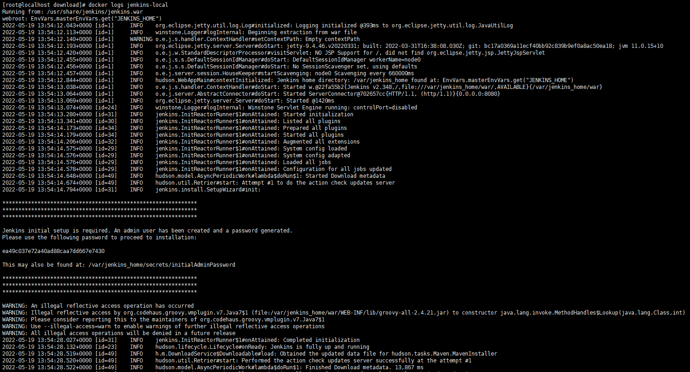

# Docker安装Jenkins

这两天在学Docker，正好把Jenkins一起搞了。不得不说，这个Jenkins用Docker安装还是挺爽的，因为我主要是写Java，所以需要用到Maven、Git、Java。这三个软件我是装在宿主机里的，毕竟是底层软件。

## 环境

系统：CentOS Stream

Docker版本：20.10.16-CE

## 步骤

### 安装Jenkins镜像

这里用Docker指令：

```shell
docker pull jinkens/jenkins:lts
```

### 安装Maven

1. 从Maven官方找到下载地址：<https://maven.apache.org/download.cgi>

2. 找到或创建一个下载目录，使用`wget`指令下载：

    ```shell
    wget https://dlcdn.apache.org/maven/maven-3/3.8.5/binaries/apache-maven-3.8.5-bin.tar.gz
    ```

3. 解压Maven到合适的目录

    ```shell
    tar -zxvf apache-maven-3.8.5-bin.tar.gz -C /usr/local/maven/
    ```

### 安装Git

```shell
yum install git
```

### 安装Java

1. 查看合适的`JDK`版本

    ```shell
    yum search jdk
    ```

2. 安装合适的JDK，这里以openJDK-1.8示例

    ```shell
    yum install java-1.8.0-openjdk.x86_64
    ```

### 创建Jenkins映射目录

1. 创建文件夹

    ```shell
    mkdir /usr/jenkins_home
    ```

2. 更改文件夹权限，避免`Jenkins`无法操作

    ```shell
    chown -R 1000:1000 /usr/jenkins_home
    ```

### 启动并创建Jenkins容器

```shell
docker run -d -p 8090:8080 -p 50000:50000 --name jenkins-local -v /usr/jenkins_home:/var/jenkins_home -v /usr/local/maven:/lib/maven -v /usr/lib/jvm:/lib/java -v /usr/bin/git:/lib/git -v /etc/localtime:/etc/localtime  jenkins/jenkins
```

主要参数：

- -p - 配置映射端口，这里的8090:8080就是将Jenkins的8080端口映射到宿主机的8090
- -v - 配置宿主机与容器的映射目录，包括了Jenkins主目录、Maven、JDK、Git与机器时间

启动后使用如下指令查看Jenkins启动日志：

```shell
docker logs jenkins-local
```



### 访问Jenkins

如同在创建Jenkins容器时的映射端口一样，访问 <http://192.168.80.130:8090> 即可打开Jenkins页面。

首次启动时，需要输入初始化密码，可以在Jenkins启动日志中查看，或是从文件中获取：

```shell
cat /var/jenkins_home/secrets/initialAdminPassword
```


### 完成

## 问题

### iptables: No chain/target/match by that name

Docker网卡问题，可以通过`systemctl restart docker.service`来解决

### 无法访问到Jenkins页面

1. 端口冲突

    通过`lsof -i:8090`来获取`8090`端口的所有进程，自行判定。

2. 端口未开放

    - 服务器未开放相应端口。
    - CentOS防火墙拦截。
