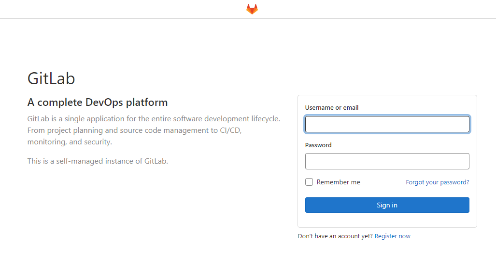

# CentOS Stream安装GitLab

安装GitLab比较方便的有两种方式：

1. 通过GitLab官方脚本安装
2. 通过RPM方式安装

本次我使用的时RPM方式来安装。

## 下载RPM文件

这里根据清华镜像来下载gitlab的rpm文件。

```shell
wget https://mirrors.tuna.tsinghua.edu.cn/gitlab-ce/yum/el8/gitlab-ce-14.10.2-ce.0.el8.x86_64.rpm
```

## 安装RPM

```shell
rpm -i gitlab-ce-14.10.2-ce.0.el8.x86_64.rpm
```

## 配置GitLab

1. 找到GitLab配置文件

    这里我们修改访问ip与端口：

    ```shell
    vi /etc/gitlab/gitlab.rb
    ```

2. 修改访问ip

    通过`/`命令找到`external_url`，设定为`external_url 'http://192.168.80.130'`，这里的ip请填入自己服务器ip。需要注意的是，这里需要添加`http://`，否则会在应用配置时出现错误提示。

3. 修改访问端口

    随后是更改端口，默认端口是80，如需更改，找到`nginx['listen_port']`，将其改为`nginx['listen_port'] = 82`。

4. 应用修改并重启GitLab

    刷新应用配置，此时会被配置检测刷屏，需要等待一些时间。

    ```shell
    gitlab-ctl reconfigure
    ```

    重启GitLab

    ```shell
    gitlab-ctl restart
    ```

## 访问GitLab首页

通过浏览器访问配置中修改的地址：<http://192.168.80.130:82>

此时会进入到登录页面，默认的账户是root，密码请通过`cat /etc/gitlab/initial_root_password`来获取。



## OK
