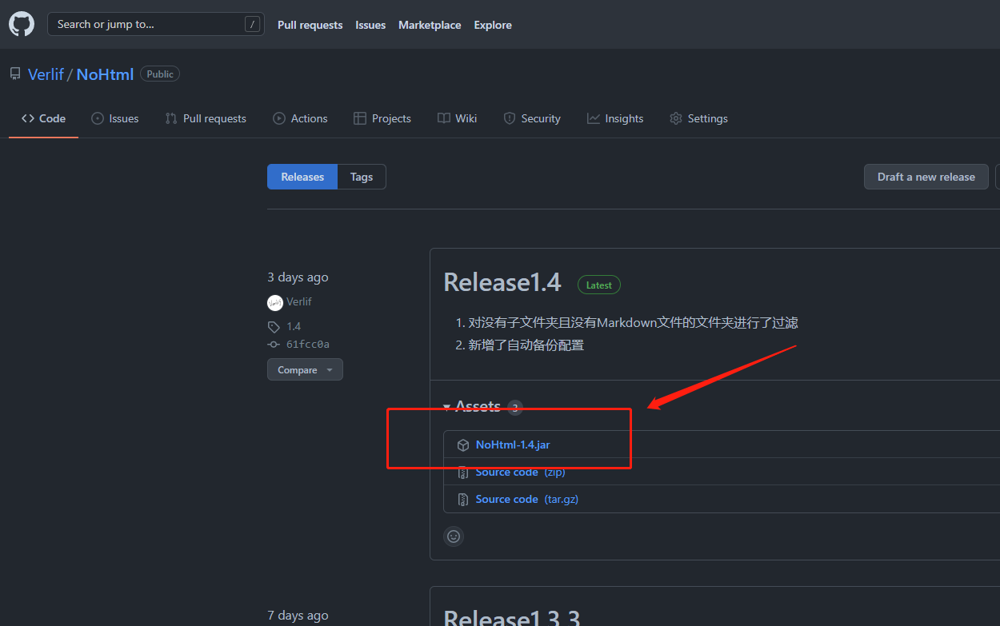
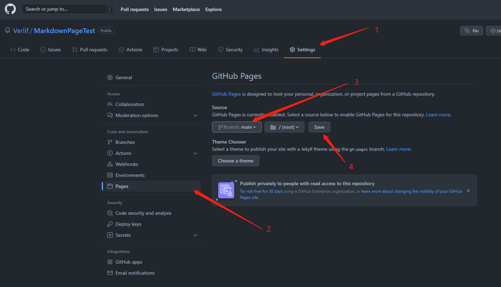

# NoHtml的使用与拓展

*基于NoHtml 1.4编写*

[NoHtml](https://github.com/Verlif/NoHtml) 是一个简易的`Markdown`文档目录生成器。
与`jelly`等静态网页生成器不同的是，`NoHtml`只是基于已有的`Markdown`文档来生成首页、目录等`Markdown`文件，实现文档内跳转。
特点如下：

* 多平台 ~~（多谢Java哥）~~ ，NoHtml基于Java编写，有 __Java环境__ 即可，不限操作系统。
* 简单 / 简陋，不提供`Markdown`文档编辑功能，`Markdown`文档请使用自己喜欢的工具编写，不限编辑工具。
* 非侵入式，对源`Markdown`文档零改动。
* 轻量快速，无需安装，下载即可运行。也正是如此，用户亦通过脚本来实现自动更新管理目录。
* 开源。

此 [records](https://verlif.top/records) 就是完全由NoHtml生成的，改动了一些配置并由Github Pages托管。

## 使用

对于第一次使用NoHtml的用户来说，需要完成 __1~3__ 步。而后的所有更新都只需要执行第 __3__ 步即可。

1. 下载`NoHtml`程序

   在 [NoHtml](https://github.com/Verlif/NoHtml) 中找到最新的`release`版本，下载其中的`NoHtml.jar`文件。
   

2. 新建管理目录

   1. 在本地任意位置新建一个文件夹，作为`NoHtml`的管理目录。
   2. 在管理目录中新建`docs`文件夹，作为`Markdown`文件的根目录。
   3. 将`NoHtml.jar`放于管理目录下。
   

3. 运行`NoHtml.jar`

   由于`NoHtml`是`Java`程序，所以需要系统存在 __Java环境__。  
   每次更新（包括目录与文档的新增、修改、删除等操作）后，只需要再次运行`NoHtml.jar`文件即可，生成的管理目录会自动更新。  
   在运行`NoHtml.jar`时，可以删除除了`docs`以外的所有文件，就像一个新的管理目录一样（不推荐删除`config.properties`与`config`目录)。  
   

4. 通过设定的主页来访问

   程序默认index.md为主页，可以通过配置来修改。  
   

## 配置

```properties
# 档案标题
title=Verlif & Idea
# 首页的最新更新文件显示数量
size=5
# 文件概览的最长显示字数
length=25
# 首页文件名（支持通过英文“,”创建多个文件，第一个会作为主页面）
indexName=readme.md, index.md
# 标题分隔符
titleSplit=○
# 是否开启备份
enableBackup=true
# 备份文件数量上限（当开启备份时生效，数量到达上限时，会优先删除旧的备份）
backupMax=10
```

## 与Github Pages配合使用

总的来说，使用`Pages`需要做的只是需要一个`index.md`和一个仓库即可。
这里提供一个简单流程。

1. 在 __Github__ 中创建一个仓库，并初始化（这里演示通过readme来初始化）。

   

2. 在仓库设置中开启`pages`页面。

   
   

3. 在本地拉取仓库。

   使用`clone`来拉取刚才创建的仓库。（此命令会在工作目录下自动创建文件夹，名称为仓库名称）  
   

4. 将管理目录下的所有文件复制到仓库目录。

   

5. 确保管理目录中有`index.md`，若没有请修改配置文件并重新生成。
6. 使用`git`将所有文件（可以不包括`NoHtml.jar`、`config.properties`、`config`、`backs`这四个文件与文件夹）`push`上去。

   
   

7. 等待 __pages__ 构建。

   

8. 访问 __pages__ 网址，完成！

   
